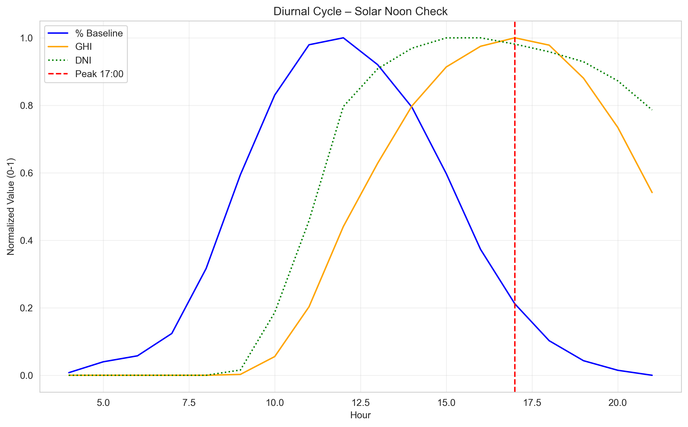
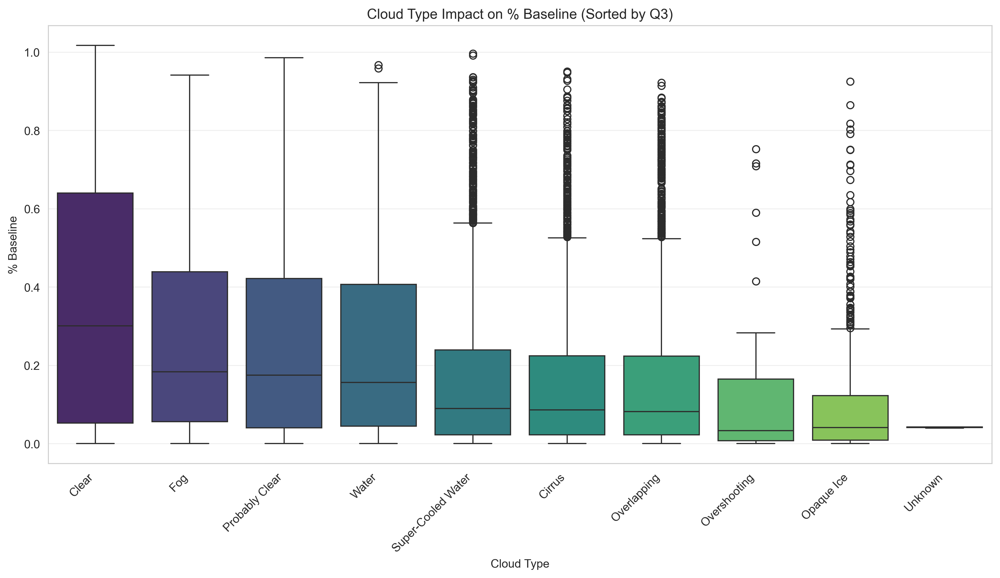

# Solar Energy Efficiency Prediction
Forecasting hourly solar plant energy output using irradiance, weather, and astronomical features.

This project uses data from the DAC PRS ITS 2024 Preliminary Round competition.
Because the dataset is part of a competitive challenge and subject to usage restrictions, the raw files cannot be publicly displayed or redistributed in this repository.


## Project Overview

This repository implements a complete machine learning workflow for predicting **% Baseline**, the hourly percentage of energy generated relative to the plant storage capacity. The original competition dataset contains only timestamps and target values, so this project enriches the data with merged weather observations, multi year solar irradiance records, and engineered astronomical features.

The workflow follows a structured sequence consisting of data cleaning, exploratory analysis, feature engineering, model training, and evaluation. Each step uncovers important physical patterns that drive solar energy production and ensures that the model is trained on meaningful, consistent information.

## Project Structure

```text
solar-panel-efficiency-analysis
├── .gitignore
├── README.md
├── requirements.txt
│
├── data
│   ├── processed
│   │   ├── train.csv
│   │   ├── test.csv
│   │   ├── train_engineered.csv
│   │   └── test_engineered.csv
│   │
│   └── raw
│       ├── metadata.csv
│       ├── train.csv
│       ├── test.csv
│       ├── Weather.csv
│       └── solar-irradiance/
│
├── notebooks
│   ├── 01_cleaning.ipynb
│   ├── 02_eda.ipynb
│   ├── 03_preprocessing.ipynb
│   ├── 04_train.ipynb
│   ├── 05_postprocessing.ipynb
│   └── 06_evaluate.ipynb
│
├── reports
│   ├── executive_summary.md
│   ├── final_report.pdf
│   │
│   └── figures
│       ├── general/
│       ├── astronomical/
│       ├── monthly/
│       └── similar/
│
└── src
    ├── preprocessing.py
    ├── exploration.py
    └── modeling.py
```

## Workflow Summary

### 1. Data Cleaning
The initial phase focuses on unifying several independent data sources into a single reliable dataset.
Weather logs, solar irradiance archives spanning multiple years, and competition-provided train/test tables are inspected for encoding issues, structural inconsistencies, and missing values. Timestamps are standardized and used as the central key for merging. This stage resolves format mismatches, identifies physically meaningful missing entries (such as moonrise/moonset gaps), and exports a clean, validated dataset ready for exploration.

### 2. Exploratory Data Analysis
The EDA phase investigates how environmental conditions influence solar energy output.
Visualizations reveal daily irradiance profiles, seasonal changes, cloud-type dynamics, and atmospheric effects such as humidity or temperature. By examining how % Baseline responds to sky clarity, solar geometry, and weather variability, the analysis uncovers patterns that guide the design of engineered features and improve the physical grounding of the model.

Example figures used in the analysis (available in `reports/figures/astronomical/`):

<p align="center">
  
  
</p>

### 3. Feature Engineering
This step transforms raw observations into features that better capture solar radiation behavior and atmospheric interactions.
The workflow constructs temporal features such as solar-corrected time, hour of day, and day of year; physical indicators such as clear-sky deviations; categorical encodings for cloud types; and STL-based decompositions to separate trend and seasonal structure. Rolling irradiance statistics and cluster-based weather groupings further enhance the dataset.
The engineered outputs are saved as `train_engineered.csv` and `test_engineered.csv` to ensure reproducibility and faster experimentation.

### 4. Model Training
Machine learning models are trained using the enhanced feature set.
Pipelines combine preprocessing steps (imputation, scaling, encoding) with gradient boosting models such as XGBoost and LightGBM. Cross-validation ensures that the models generalize well, while feature importance analysis highlights which environmental factors contribute most to prediction accuracy. This stage iterates through multiple configurations to balance performance and interpretability.

### 5. Postprocessing and Evaluation
The final predictions undergo physical and statistical adjustments, such as nighttime masking based on sunrise/sunset times and error calibration. Evaluation notebooks compare model variants, visualize prediction trends, and assess consistency across time.
This step ensures that the model behaves realistically and that its output aligns with solar production patterns observed in the data.

## Purpose of the Repository
This project provides a complete, reproducible pipeline for forecasting solar energy efficiency using environmental, irradiance, and astronomical information. It demonstrates structured dataset preparation, domain-informed feature engineering, and a robust modeling workflow designed to capture the physical drivers behind solar energy production. The repository serves both as a practical solution and as a reference for renewable-energy forecasting projects.

Although this work was submitted late to the DAC PRS ITS 2024 Preliminary Round competition, it achieved final scores of **MSE 0.0037** and **MSE 0.0035**. Despite the delayed submission, the analysis offered numerous valuable insights into how solar irradiance, weather conditions, and atmospheric dynamics interact to affect energy output, contributing significantly to the learning process and understanding of the problem domain.

---

This project was created by **Muhammad Rafli Azrarsyah**, a third-year Actuarial Science student at Universitas Gadjah Mada who simply enjoys working with data and discovering the stories and insights hidden within it. This competition became an unexpected but exciting realization of how interesting and powerful data analysis can be.